- This application has 2 panels namely Admin & Toiletowner panel with an API for users side.
- Admin panel can manage all users toiletowners, toilets, users, toilet usages that is transcations.
- Toiletowner have to register with email & contact number and wait for the approval of admin to approve as active toiletowner to create toilets.
- If toiletowner is not active they cant add or create new toilets until they are being approved by admin.
- Toilets can have maps, address, and full location precision with map marker, also with type of toilet i.e. Male, Female or both to use for.
- For users simply give your phone number make payment & done you can use that booked toilet when ever you want to use.
- Here are some highlights for this project:
 

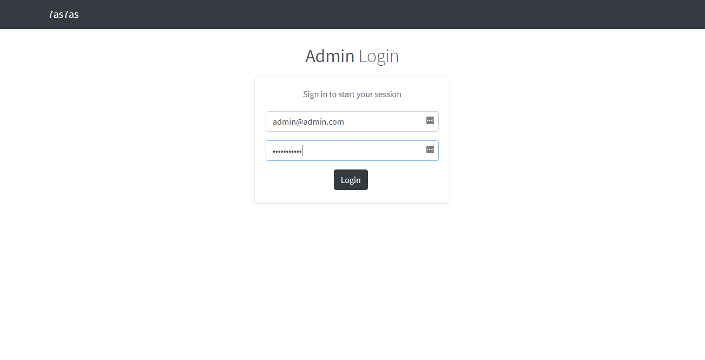
Login for admin

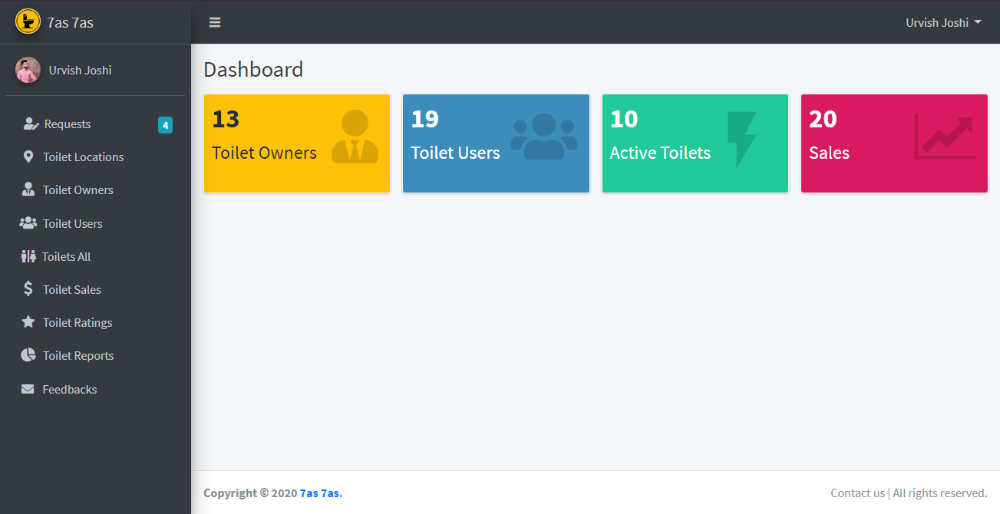
Admin panel home page for displaying records

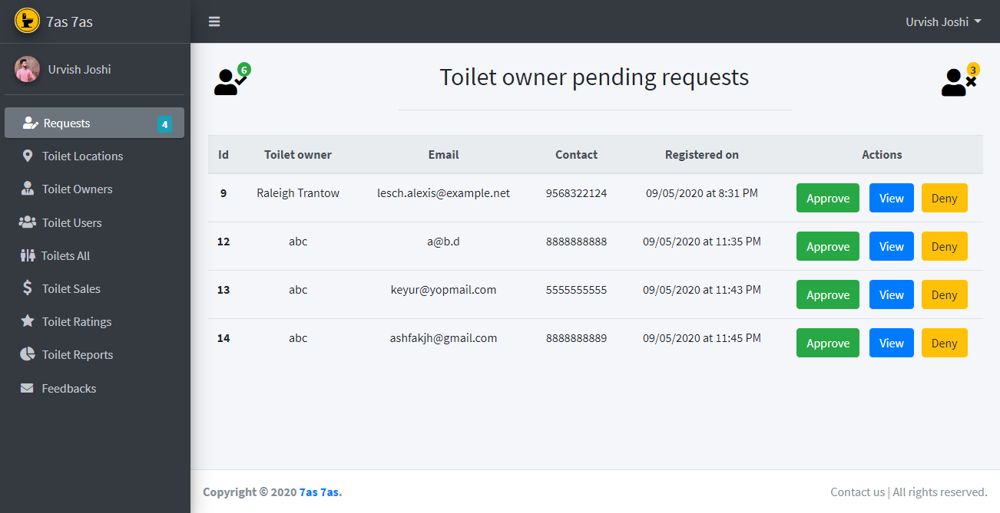
Requests of toiletowners to give approval to create toilets

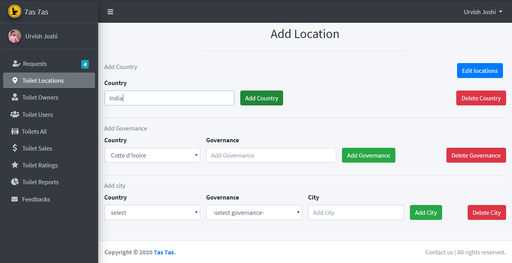
Locations to create toilets in added city, districts & countries

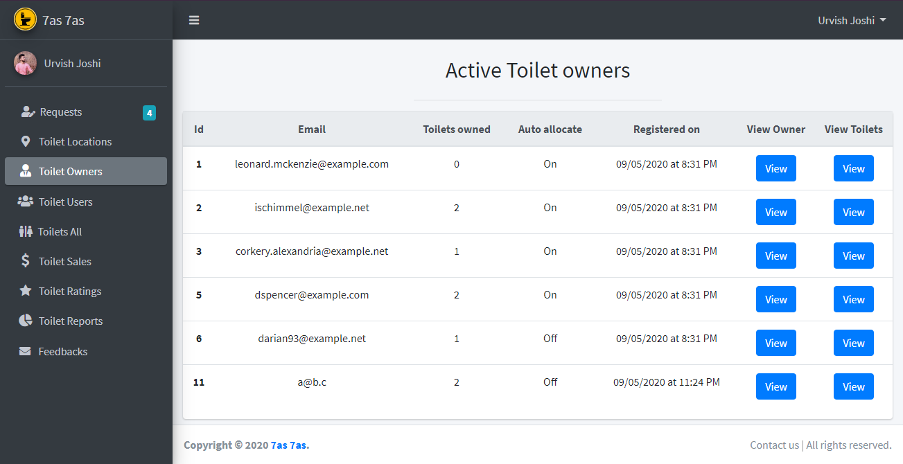
All active toilet owners

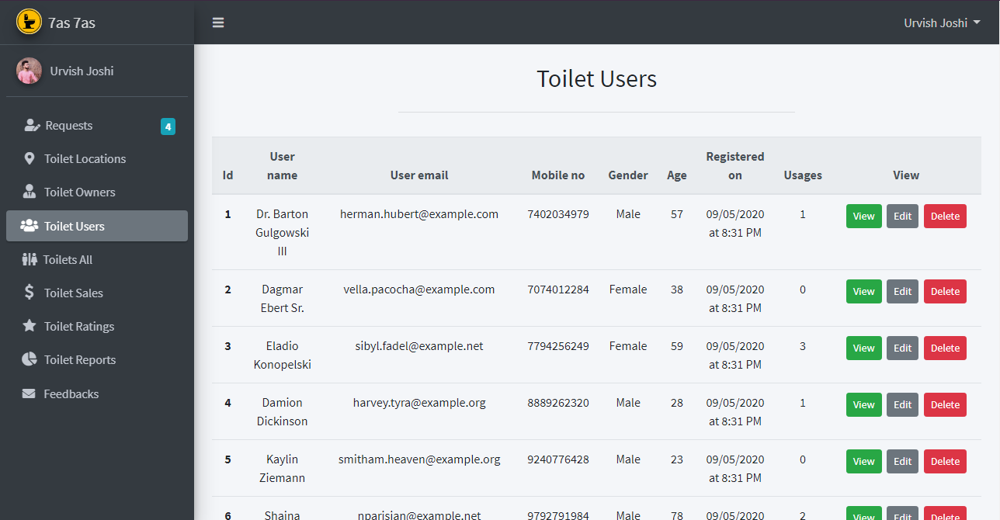
All registered toilet users

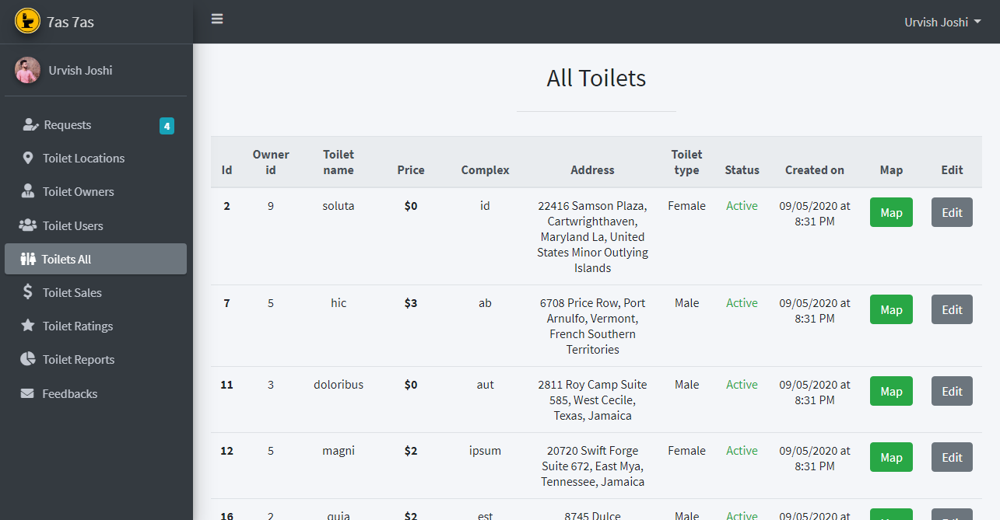
All registered toilets

All sales of toilets used by users

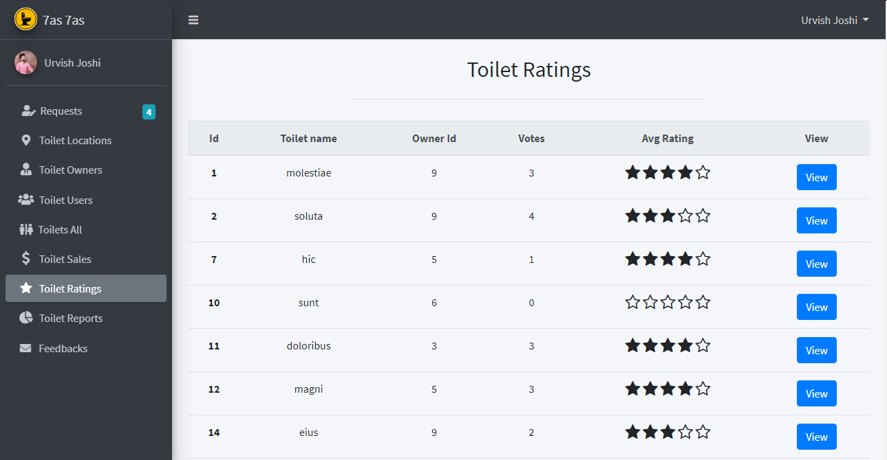
Ratings of toilets given by users

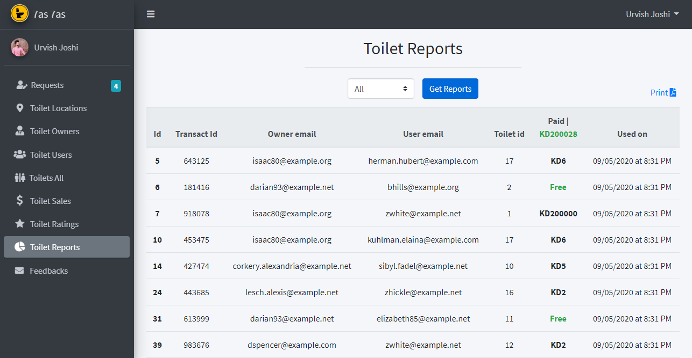
Reports for transactions of sales

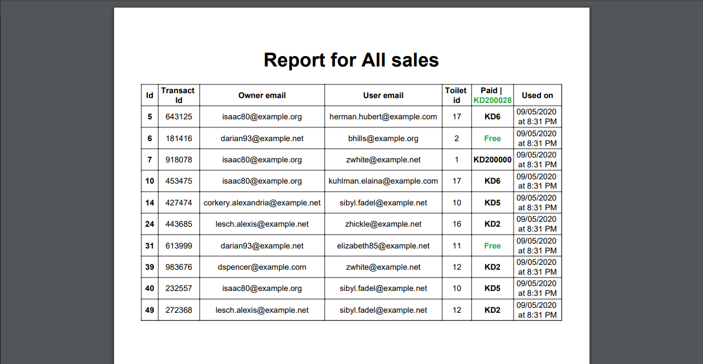
PDF to export of sales

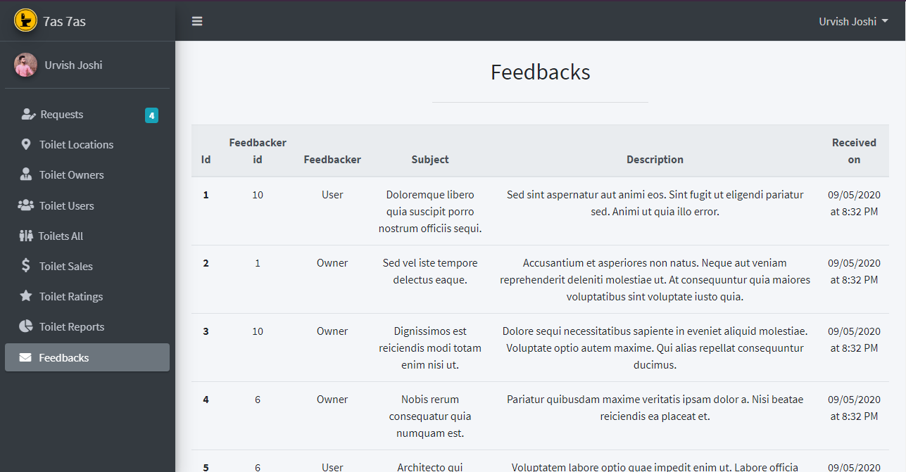
Feedbacks received by toiletowners & toiletusers
